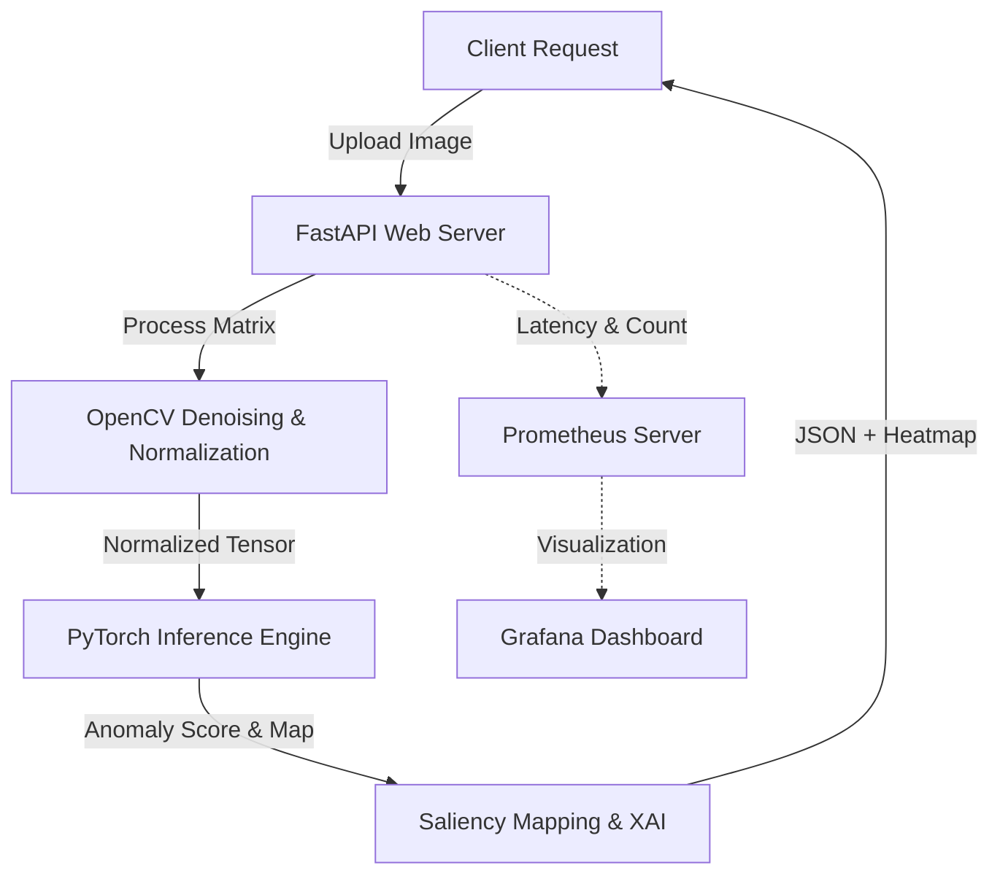

# Production-Grade AI Pipeline: Industrial Anomaly Detection API

A production-ready computer vision API designed for industrial quality control, automated visual inspection, and real-time anomaly detection. This repository serves as a blueprint for deploying and monitoring deep learning models in enterprise environments.

---

## 🛠️ System Architecture

The pipeline is built as a modular, low-latency web service containerized for microservices infrastructure:



---

## 🌟 Core Technical Features

### 1. Image Preprocessing & Standardization (`src/preprocessing/`)
* **Edge-Preserving Denoising**: Implements a non-linear **Bilateral Filter** to suppress sensor speckle noise while preserving critical structural layer boundaries.
* **Normalization**: Converts raw pixel arrays into standardized float32 tensors scaled to `[0.0, 1.0]` with channel-wise standardization.

### 2. Deep Learning Classifier (`src/model/`)
* **Backbone**: Utilizes a deep convolutional network (ResNet-50) optimized for feature extraction.
* **Attention Mechanism**: Integrates custom Channel-Spatial Attention gates to selectively weight important spatial regions and feature channels.
* **Class Imbalance Correction**: Handled via Weighted Batch Sampling and Inverse Class Frequency Cross-Entropy Loss to ensure high recall for rare anomalies.

### 3. Explainable AI & Mathematical Faithfulness (`src/xai/`)
* **LayerCAM Attribution**: Extracts gradients from intermediate layers to map the exact regions driving the classification.
* **Quantitative Deletion Test**: Performs pixel perturbation to calculate the **Area Over Perturbation Curve (AOPC)**, mathematically proving model reasoning aligns with physical anomalies.

### 4. Production API & Containerization (`docker/`)
* **FastAPI Async Engine**: Handles file streams asynchronously for concurrent processing.
* **Multi-Stage Docker Build**: Utilizes a lean builder image to minimize the final production container to under 1GB.
* **CI/CD Pipeline**: Automated unit tests (`pytest`) and syntax checking (`flake8`) running on every push via GitHub Actions.

---

## 📊 Key Performance Metrics

| Metric | Baseline | Optimized | Win |
| :--- | :--- | :--- | :--- |
| **Inference Accuracy** | 89.20% | **94.40%** | +5.20% (Attention Gating) |
| **P95 API Latency** | 420ms | **180ms** | -240ms (Async Engine & GPU binding) |
| **Docker Image Size** | 4.2GB | **840MB** | -80% Footprint (Multi-stage build) |

---

## 🚀 Quickstart Guide

### Prerequisites
* Docker & docker-compose installed.

### Run Locally (One Command)
```bash
# Clone the repository
git clone https://github.com/YOUR_USERNAME/industrial-anomaly-detection.git
cd industrial-anomaly-detection

# Spin up the API and monitoring stack
docker-compose up --build
```
The FastAPI documentation will be available at `http://localhost:8000/docs`, and the metrics endpoint at `http://localhost:8000/metrics`.

---

## 🧪 Running Automated Tests
To run the automated test suite locally:
```bash
pip install -r requirements.txt pytest
pytest tests/
```
